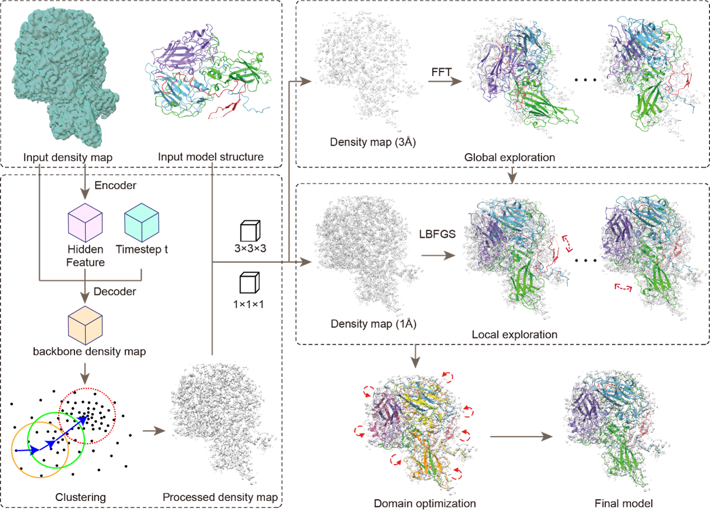

# [Iscience 2024] DEMO-EMfit: Coupling Deep Learning-Enhanced Map Processing with Global-Local Optimization for Protein Structure Fitting in Cryo-EM Maps

<h4 align = "center">Yaxian Cai1,2, XXXXX2, XXXXX1, XXXXX1, Xiaogen Zhou1</h4>
<h4 align = "center"> $^1$ Zhejiang University of Technology
</h4>
<h4 align = "center">$^2$ XXXXX</h4>
                     
                       

## Abstract
With the increasing volume of macromolecular density map data, the application of cryo-EM in structural biology research is becoming increasingly widespread. However, corresponding fitting techniques are now facing higher demands in terms of accuracy and efficiency. In this study, we propose an innovative fitting method that first preprocesses density maps using deep learning, followed by a global-local optimization strategy to accurately fit protein structures into cryo-EM density maps. This method was comprehensively tested on both ET and EM datasets, with results showing that the DEMO-EMfit model achieved an average TM-score of 0.79 and an RMSD of 18.03 Å, demonstrating higher precision and stability. Further detailed analysis indicates that this approach significantly enhances the accuracy of cryo-EM density map fitting and effectively reduces structural errors.

## Our Pipeline

## Dependencies

* Install 32-bit Dynamic Linker
CentOS:
   >sudo yum install epel-release -y
   >sudo yum install glibc.i686

* Install boost
CentOS:
   >yum install boost boost-devel

## How to run DEMO-EMfit

In Linux system with 64-bit and the right directory, you can run the program in the command window without arguments to obtain a brief instruction

>./DEMO-EMfit

Here, an example is shown as follows:

>./DEMO-EMfit  model  map   resolution

## Options in DEMO-EMfit
		 << Options:
		 << "       -fit  Whether to perform flexible model fitting
		 << "             0: (default) perform rigid-body model fitting only, and domain-based 
		 << "                 optimization can be performed using '-dbo 1			 
		 << "             1: perform complex reassembly and domain-based optimization
		 << "       -dc   density threshold (recommended contour level), default: 0
		 << "       -ct   CC cutoff for good fitting when use '-fit 1', default: 0.6 	 
		 << "       -gwg  map grid width for global exploration, default: 3		 
		 << "       -gwl  map grid width for local exploitation, default: 0 (original) 
		 << "       -nco  number of parallel threads, default: all cores		 
		 << "       -opn  output name in 'XXX.pdb' format, default: input name 
		 << "       -py3  directory of python3 (require for report CC), default: python		 
		 << "       -dbo  Whether to perform domain based optimization when use '-fit 0'
		 << "             0: (default) only perform rigib-body fitting
		 << "             1: perform domain-based optimization 	 
		 << "       -rps  Whether to report CC scores of final model
		 << "             0: (default) no 
		 << "             1: yes		 
		 << "       -sl   Whether to print intermediate information
		 << "             0: (default) no
		 << "             1: yes			

		 << " Following options are only for test:
		 << "       -ngb  number of poses to explore by global fitting, default: 20 		 
		 << "       -nlc  number of poses to explore by local fitting, default: 20 			 
		 << "       -seg  perform map segmention based on contour (0:no, 1:yes), default: 1 
		 << "       -s6   perform grid searching for inital positions (0:no, 1:yes), default: 0		 
		 << "       -gb   run global exploration only (0:no, 1:yes)
		 << "       -lc   run local explitation only (0:no, 1:yes)	 
		 << "       -rm   remove matched map region for '-fit 1'(0:no, 1:yes)
		 << "       -it   assembly by iteration for '-fit 1'(0:no, 1:yes), default: 1
		 << "       -i6d  use initial fittings by global searching (0:no, 1:yes), default: 1		 
		 << "       -lco  run local domain optimization for '-fit 1'(0:no, 1:yes), default: 1 
		 << "       -dmm  run domain matching for '-fit 1'(0:no, 1:yes), default: 1 

		 << " Notes: 
		 << "        "<< Input model can be a PDB file or a directory containing multiple models.
		 << "        "<< Models should be in separate directories or write in a PDB file if you 
		 << "        "<< have multiple models to fit, such as when assemble multiple chains. 
		 << "        "<< All models should be in PDB format, and maps should be in MRC/CCP4 format.		 
		 << "        "<< '-rsc' shoule be in (0,1), recommend: 0.6.
		 << "        "<< '-dc' shoule be in (0,1), recommend: 0.005. 
		 << "        "<< Output models are named as 'CmodelX.pdb' and saved in 'model_path'.

         
## Acknowledgments

This program is an implementation of DEMO-EM2 in C/C++ (Version: 20241212) by

 Xiaogen Zhou and Ziying Zhang at
 College of Information Engineering
 Zhejiang University of Technology 
 288 Liuhe Rd, Hangzhou, China, 310023                                                     
           
Please report bugs and questions to zxg@zjut.edu.cn
